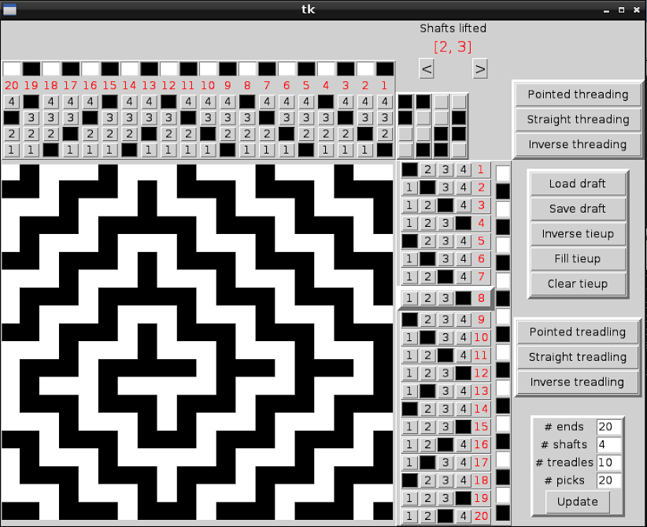

A Python app for visualising weaving drafts and animating the 
threading/treadling process to keep track of your position.

Usage:
```
python drawdown.py
```

Example output after selecting the provided spirals.txt draft:
